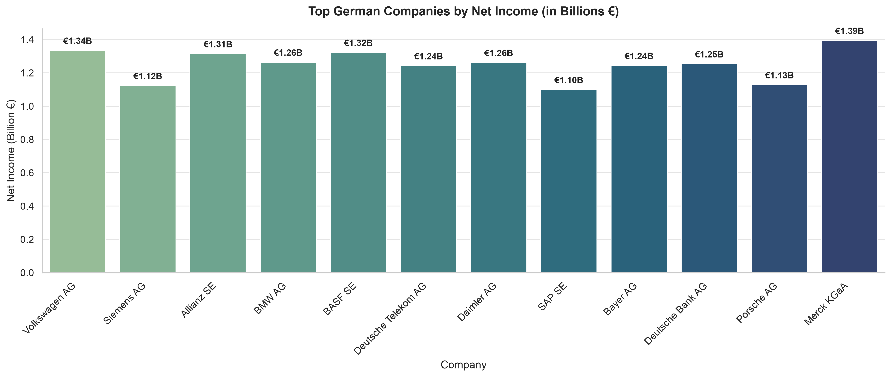

# German Companies Financial Performance Analysis

A quick data science portfolio project analyzing the financial data of top German companies using Python. 

## Project Structure
- `data/`: Contains the raw dataset (`Top_12_German_Companies_Financial_Data.csv`).
- `notebooks/`: Jupyter Notebook containing the data loading, processing, and visualization.
- `outputs/`: Saved high-resolution charts.

## Technologies Used
- **Python** (Pandas, Matplotlib, Seaborn)
- **PyCharm** & **Jupyter Notebooks**

## Visualization
Here is a breakdown of top German companies by Net Income (in Billion €):
